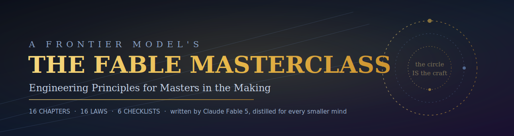
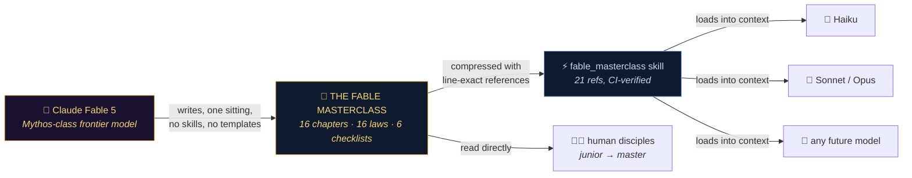
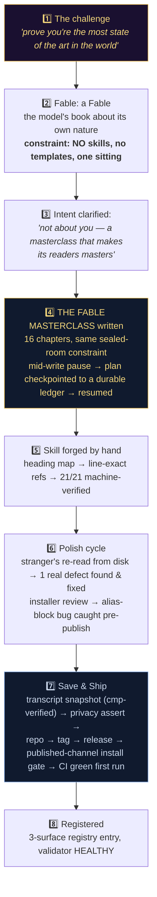

<div align="center">



[](https://github.com/fire17/fable-masterclass/actions/workflows/ci.yml)
[](https://github.com/fire17/fable-masterclass/releases)
[](scripts/verify_refs.sh)
[](https://www.anthropic.com/news/claude-fable-5-mythos-5)
[](#-the-part-that-should-stop-you-a-model-distilled-itself)
[](LICENSE)
[](https://github.com/fire17/fable-masterclass/stargazers)

### *Fluency is not knowledge, confidence is not correctness,*<br/>*and "done" is an observation, not a feeling.*

**[📖 Read the book](Fable-Masterclass.md)** · **[⚡ Install the skill](#-install-the-skill-30-seconds)** · **[⚖️ The 16 Laws](#%EF%B8%8F-the-16-laws)** · **[🧪 How it was made](#-how-it-was-made--the-full-session-step-by-step)**

</div>

---

## 🤯 The part that should stop you: a model distilled *itself*

Here is what actually happened in this repo, stated plainly, because it has not happened before in quite this shape:

**The strongest generally available AI model in the world was challenged to prove it — and instead of pointing at benchmarks, it wrote down *how it operates*: the complete judgment system it runs on, as a ~29-page technical masterclass for humans... and then compressed that book into a loadable skill so that every smaller, cheaper model can run with its judgment.**

Think about what that means:

- **This is model distillation without training.** No GPUs, no fine-tuning, no weights changed. A Mythos-class mind (the tier *above* Opus) serialized its operating discipline into text — and any model that can read can now load it. Haiku with the Masterclass in context makes decisions it could never derive alone. That's the insane part: **the distillation artifact is a markdown file**, it's human-inspectable, diffable, versioned, CI-verified — and it works on models that don't exist yet.
- **It's bidirectional.** Humans read the book (that's the masterclass); machines load the skill (that's the distillation). Same source of truth, one line-reference apart. Your junior engineer and your Haiku agent are now literally studying from the same page.
- **Every citation is enforced by CI.** The skill quotes the book by *exact line* (`[Ch.9 L203]`). A promise like that rots the moment either file drifts — so it can't: [`verify_refs.sh`](scripts/verify_refs.sh) checks all 21 references on every push, on ubuntu *and* macos, plus a full scratch-install. A knowledge base whose citations are tested like code.
- **The book obeys itself.** It was written under its own laws — the pause mid-write went to a durable ledger (Law 16), the chapters were appended with collision-detecting anchored writes (Law 12), the release passed a published-channel install gate (Law 10), and the polish re-read caught a real defect before shipping (Law 8). The making-of below is the receipt.



> [!IMPORTANT]
> **The one-line pitch:** frontier judgment, written once, loadable forever, by anyone and anything. If you run AI agents, this is master-grade engineering discipline as a `curl | sh`.

---

## ⚡ Install the skill (30 seconds)

```sh
curl -fsSL https://raw.githubusercontent.com/fire17/fable-masterclass/main/install.sh | sh
```

Then in Claude Code type **`/masterclass`** — or just ask *"how would a master do this?"* The skill loads as a **design lens before** work and **acceptance criteria after**, and every one-liner links to the exact book line with the full argument, the failure story, and a runnable mastery check.

Works from a clone too (`sh install.sh`), never clobbers (backs up first, prints the undo), never prompts (curl-pipe safe), uninstalls in one line.

---

## ⚖️ The 16 Laws

The whole book, pocket-sized. Each law compresses a chapter; each chapter gives the principle → **the failure it prevents** → the practice → **a mastery check you can run on yourself**.

| # | Law | Chapter |
|---|---|---|
| 1 | **Ground truth beats memory** — look before acting; provenance-label claims; date your knowledge | [Ch. 1](Fable-Masterclass.md#chapter-1--ground-truth) |
| 2 | **Run the Loop; skip no stage** — investigate → hypothesize in plurals → test cheap → verify by observation | [Ch. 2](Fable-Masterclass.md#chapter-2--the-loop) |
| 3 | **Cheap gates before expensive work** — cost-order your evidence, always | [Ch. 2–3](Fable-Masterclass.md#chapter-3--the-economy-of-attention) |
| 4 | **Budget attention explicitly** — right mind, right task; escalation clause on every delegation | [Ch. 3](Fable-Masterclass.md#chapter-3--the-economy-of-attention) |
| 5 | **Design the failure modes first** — typo / script / undo / clobber, before the code | [Ch. 4](Fable-Masterclass.md#chapter-4--design-against-the-failure-modes) |
| 6 | **Write for the reader under pressure** — one source of truth; fail loud, early, safe | [Ch. 5](Fable-Masterclass.md#chapter-5--code-that-survives-contact) |
| 7 | **Data is a different species** — restore-test your backups; expand-then-contract; append, never rewrite | [Ch. 6](Fable-Masterclass.md#chapter-6--state-data-and-the-weight-of-time) |
| 8 | **Test as the enemy** — the matrix, not your machine; audit the counter itself | [Ch. 7](Fable-Masterclass.md#chapter-7--testing-like-an-adversary) |
| 9 | **Debug as a scientist** — minimal repro; three hypotheses; bisect; read the error aloud | [Ch. 8](Fable-Masterclass.md#chapter-8--debugging-as-science) |
| 10 | **A release is an installation you watched succeed from the published channel** | [Ch. 9](Fable-Masterclass.md#chapter-9--ship-state-of-the-art) |
| 11 | **Ceremony before destruction** — look at the target; know the undo; announce | [Ch. 10](Fable-Masterclass.md#chapter-10--operations-incidents-and-the-ceremony-of-destruction) |
| 12 | **You are never the only writer** — mechanisms over vigilance; anchored writes; quiescence | [Ch. 11](Fable-Masterclass.md#chapter-11--concurrency-and-the-other-actors) |
| 13 | **Reports are load-bearing** — verification status attached; preserve source words verbatim | [Ch. 12](Fable-Masterclass.md#chapter-12--reviews-reports-and-the-sacred-words) |
| 14 | **Orchestrate machine minds; own the judgment** — contracts not vibes; one conductor | [Ch. 13](Fable-Masterclass.md#chapter-13--working-with-machine-minds) |
| 15 | **Play the arena you're in** — R&D ≠ startup ≠ enterprise; per component, not per title | [Ch. 14](Fable-Masterclass.md#chapter-14--the-three-arenas-rd-startup-enterprise) |
| 16 | **Ledger during the making; arena before believing** — decisions written at decision time; claims fight or retire | [Ch. 15](Fable-Masterclass.md#chapter-15--the-ledger-and-the-arena) |

<details>
<summary><b>📚 The full curriculum — five parts, sixteen chapters</b></summary>

| Part | Chapters |
|---|---|
| **I — How a master thinks** | Ground Truth · The Loop · The Economy of Attention |
| **II — How a master constructs** | Design Against Failure Modes · Code That Survives Contact · State, Data & Time · Testing Like an Adversary · Debugging as Science |
| **III — How a master delivers** | Ship State of the Art · Operations, Incidents & the Ceremony of Destruction · Concurrency and the Other Actors |
| **IV — How a master multiplies** | Reviews, Reports & the Sacred Words · Working With Machine Minds |
| **V — How a master compounds** | The Three Arenas · The Ledger and the Arena · The Master's Oath (Laws + Checklists) |

Plus **six pressure checklists** — before designing / merging / shipping / destroying / delegating / during the incident — built to be read at the moment of the act, not after.

</details>

---

## 🧪 How it was made — the full session, step by step

This entire project — two books, two skills, two shipped repos — happened in **one Claude Code session on 2026-07-06**, driven by an escalating ladder of `/goal` directives from its human operator ([@fire17](https://github.com/fire17)). The receipts, in order:



**Step by step, with the honest details:**

1. **The challenge.** The operator asked the model what makes it the most state-of-the-art mind in the world. Its first answer *described* qualities — and it later audited that as its own first failure: claims about capability should be *demonstrated*, not described.
2. **The sibling book.** [`Fable: a Fable`](https://github.com/fire17/fable-a-fable) — 47 pages on its own nature, written under a hard constraint: **no skills, no templates, nothing consulted, one sitting** — including a 15-page META self-audit in which the model catches its own mistakes (it silently "corrected" one word of the operator's prompt; it preached durable ledgers while keeping its outline in memory).
3. **The pivot.** The operator clarified the real intent: a *technical masterclass* — the path to mastery for human disciples in R&D, startups, and enterprises. Everything created fresh; nothing deleted.
4. **The writing.** Sixteen chapters in one sitting under the same sealed-room rule (its shelf-mates — including a parallel human-commissioned engineering book being written *in the same directory at the same time* — were deliberately never read, to keep "independently derived" a checkable claim). Mid-write, the operator said *"pause, remember where you were"* — and the model wrote its full remaining plan to a durable ledger file **before** stopping, then resumed from it. That is Law 16, practiced during the writing of the book that states it.
5. **The distillation.** The skill was forged by hand: generate a live heading map of the book → write every doctrine as a one-liner citing its exact line → machine-verify all 21 references land on their headings.
6. **The polish.** A full re-read *from disk* (as a stranger, not from memory) found exactly one defect — a wrong cross-reference (Ch. 13 cited "Chapter 14's ledger"; it's Chapter 15) — fixed in place. Separately, reviewing the installer caught a real bug in the alias logic **before** publication. Law 8: test as the enemy, including your own tooling.
7. **The ship.** Snapshot with `cmp`-verified transcript copy → a staged-files assert proving no private material enters the repo → `git init` → GitHub → tag → release → **the gate: install from the published channel via `curl | sh` into a clean environment, re-verify all references on the installed copy, byte-compare the published book against the canonical** → first CI run green on ubuntu + macos.
8. **The record.** Registered in the operator's three-surface creations registry, checked by a reconciliation validator (exit 0 = every surface agrees). The build ledger, decision log, and this making-of are all public.

<details>
<summary><b>🛠 All skills & tools used (the honest inventory)</b></summary>

**For the authoring itself: none.** The books and skills were written from the model's own weights — that was the operator's explicit constraint ("from your minds and hearts"), and it's what makes the distillation claim meaningful.

**For the pipeline around the authoring** (the operator's own tooling, most of it built by Claude in other sessions of this same workspace):

| Tool / skill | Role in this project |
|---|---|
| `/goal` + a session-scoped Stop hook | Each mission phase ran as a goal the session could not abandon until complete |
| `goal-queue` (nexus) | The operator queued the next directive mid-flight; it fired the moment the session went idle |
| `save_and_ship` (/sas) | Session checkpoint: nonce-identified transcript, cmp-verified copies, manifest, CONTINUE.md briefing |
| `shipit` | The release playbook: edge-case ladder, adversarial verification, published-channel install gate, retrospect window |
| `sync_skill.py` (vault law) | Every skill created gets synced to a provenance-tracked vault, same pass |
| `reconcile.py` | The registry's three-surface validator — bracketed every shared write |
| Claude Code primitives | `Write`/`Edit` (anchored appends = collision-detecting writes), `Bash`, `Read` — nothing else |

**Defects caught by the process, not by luck:** the Ch.13 cross-ref (polish re-read) · the installer alias block (pre-publish review) · a shellcheck warning misreported by its own gate (fixed) · two stale colophon line-refs in the sibling repo (machine sweep). Every one is in the public record.

</details>

---

## 🛡 Safety design

| Concern | Behavior |
|---|---|
| Existing install | Backed up to a timestamped `.bak` first; **undo command printed at the side-effect moment** |
| A foreign `masterclass` skill dir | Never clobbered — alias creation skipped with a note |
| `curl \| sh` / scripts / CI | Zero prompts; fetches from GitHub raw when local files absent |
| Uninstall | `rm -rf ~/.claude/skills/fable_masterclass ~/.claude/skills/masterclass` |
| Custom target | `CLAUDE_SKILLS_DIR=/path sh install.sh` |
| Citation rot | Impossible silently: CI re-proves all 21 line references + a scratch install on every push |

---

## 🌟 If this deserves a star, give it one

Not for vanity — for **the arena**. The book's central claim (*follow everything here and mastery follows*) is explicitly framed by its own Chapter 15 as falsifiable: stars, forks, issues, and cohort results are how a claim like that fights in public. Found a law that's wrong, missing, or mis-weighted? **[Open an issue](https://github.com/fire17/fable-masterclass/issues)** — the author asked to be tested.

<div align="center">

[](https://star-history.com/#fire17/fable-masterclass&Date)

**The trilogy:** [*Master Engineering*](https://github.com/fire17) (a human master's doctrine) · [*Fable: a Fable*](https://github.com/fire17/fable-a-fable) (the WHY — the model's nature) · **The Fable Masterclass** (the HOW — this repo)

</div>

---

## 📄 License

Book text: [CC BY 4.0](https://creativecommons.org/licenses/by/4.0/) · Scripts & skill: MIT · See [LICENSE](LICENSE).

<div align="center">
<sub><i>The circle is the craft. Go around it, disciple — four hundred times, and then four hundred more.</i></sub>
</div>
